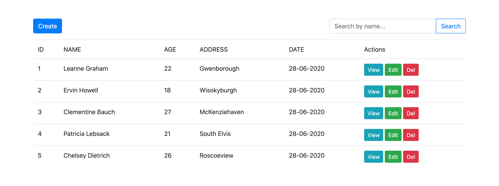
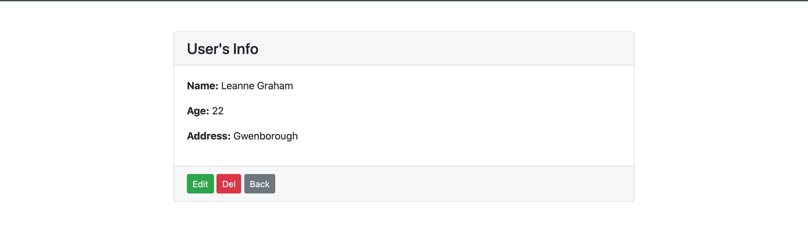
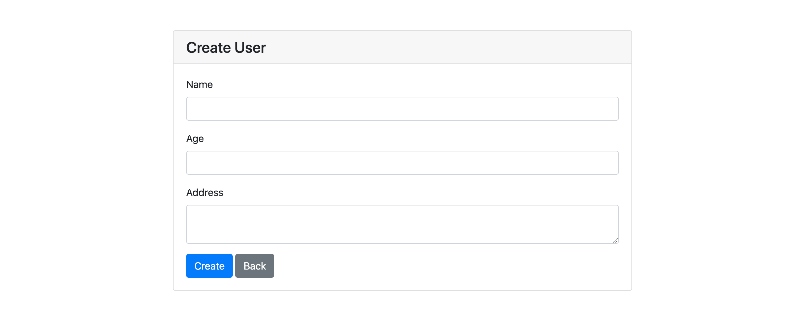
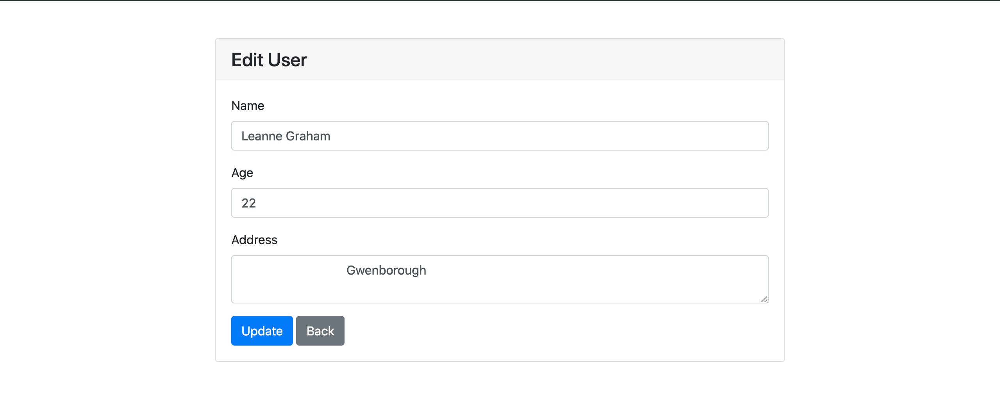

# PHP CRUD Sample

The project that is very simple project for those want to build PHP and MySQL CRUD.

## View Page

## Show Page

## Create Page

## Edit Page

## Include

- Bootstrap 4

## Features

- View all users
- View specific user
- Can search user by name
- Create users
- Edit users
- Delete users

## Installation

- git clone
- import database named `db.sql`
- run in brower `http://localhost/project_folder/`
